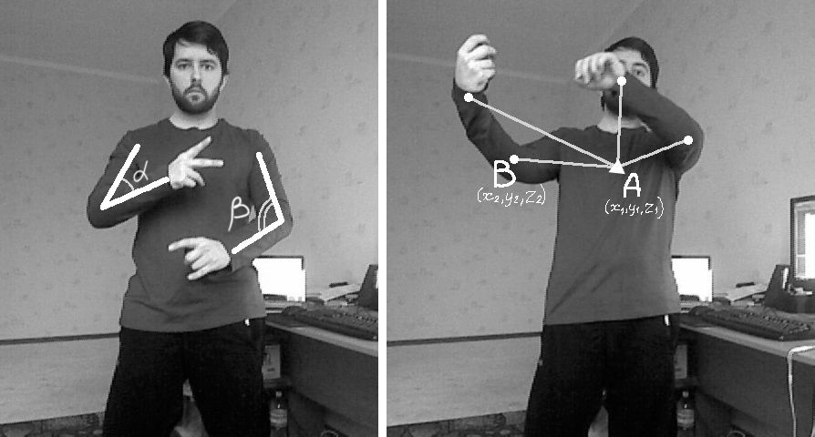
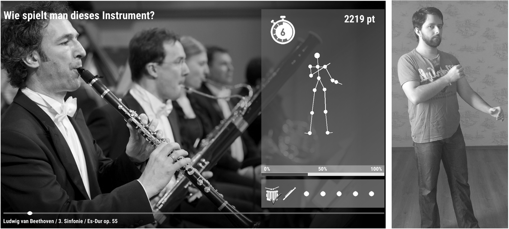

# Magic Mirror

The sources for the core library used in the Magic Mirror Project, done in collaboration with the INKA group of HTW Berlin and the Konzerthaus Berlin.

## Explanation

The purpose of the system is to recognize when a person standing in front of the Kinect is assuming a body-posture that is characteristic of playing a certain musical instrument.

The skeleton joint tracking of the Kinect is used to track the user, particularly, the wrists, the elbows, the shoulders and the middle part of the spine. Next, simple 3D-geometry is used to calculate various angle-based features. We are using the angles between the forearm and the upper arm on each side (α and β on Fig. 1), as well as the angles between the body’s centre of mass and the four essential joints of the arms: wrists and elbows (AB on fig. 1).

This makes up 12 different features in total. 

The training data is collected from several people doing the musical intrument postures, and then an SVM-based classifier is trained. The classifier is then used to recognize new postures of new users.

The project includes a C#-based wrapper library, which is in turn included into a Unity-Project, that is by itself an interactive game, where the player is presented with pictures of different musical instruments, as well as the sound of that intrument, and then asked to quickly do the correct pose for playing that instrument.

If the player is successful, they are graded on how accurate their pose is, and at the end of the game they are given a total score. You can see an example of that in the image below, or you can look at a [short video example](https://www.dropbox.com/s/ioc9afh58gagb8s/MagicMirror_Demo.mp4).

## References

The work done in the project is described in the following papers:

1. Kovalenko M., Antoshchuk S., Sieck J. "Virtual Orchestra: an Interactive Solution for a Concert Hall", Proceedings of the XV International Conference “Culture and Computer Science”, 18-27 May 2017, Berlin, 2017, pp. 169–179

2. Kovalenko N., Sieck J., Antoshchuk S. "Creating an Interactive Musical Experience for a Concert Hall", International Journal of Computing, ISSN: 2312-5381, Vol. 17, Issue 3, pp. 143-152, 2018.